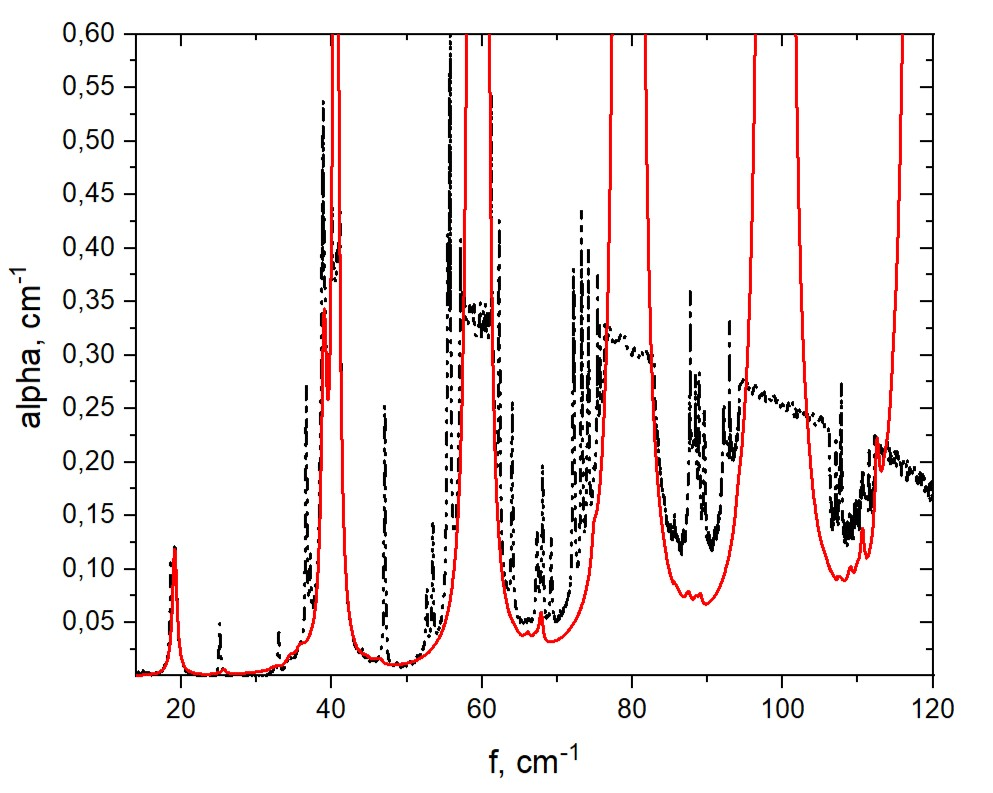

# THz газоанализ: генератор спектров → TSAR (EfficientNet-B5 + Transformer) → детектор (μ/σ)

Публичный демонстрационный репозиторий, показывающий подход «эксперимент → данные → модель → решающее правило → проверка на реальных измерениях» для терагерцового (THz) газоанализа.

Цель репозитория — **показать инженерную логику и продуктовую упаковку**: как из формального ТЗ формируется контур данных и моделей, как учитываются приборные эффекты, как настраивается риск ложных тревог и как проводится перенос с синтетики на реальные спектры.

---

## Скриншоты

**GUI генератора спектров (диапазон, профили шума/базовой линии/отсечки, пакетная генерация):**  

**Демонстрация аугментаций (приближение синтетики к реальному прибору):**  
Красная линия — модельный спектр NH₃ (HITRAN/модель, фиксированная влажность). Чёрный пунктир — тот же спектр после наложения реалистичных эффектов измерения.
- частотно-зависимый шум по профилю из калибровочных экспериментов;
- дрейф базовой линии (включая PCA-компоненты) и случайный offset;
- динамическая отсечка и эффекты насыщения детектора.  
Идея: генератор позволяет масштабно получать данные для обучения — **смеси и одиночные газы** в широком диапазоне log10-концентраций и при разных фоновых условиях (включая влажность), сохраняя параметры аугментаций для воспроизводимости.  

**Детекция на реальном эксперименте (серия NH₃, вероятностный выход μ/σ):**  
Показаны предсказания `log10(c)` и доверительные интервалы, построенные по `(μ, σ)`.
- целевой газ (NH₃) уверенно выделяется: выше порога по концентрации и с минимальной неопределённостью (узкий интервал);
- нецелевые газы остаются ниже порога и/или имеют повышенную σ (модель не “притворяется уверенной” около LOD);
- финальное решение принимает двухфакторный детектор по порогам `Tμ` и `Tσ`, где `Tσ` подбирается на большой синтетической тестовой выборке для подавления ложных срабатываний и затем переносится на реальные измерения.  

---

## Контекст и постановка

В рамках НИР решалась прикладная задача построения основы для **интеллектуального THz-газоанализа опасных примесей**:

- проверка работоспособности измерений в реалистичных условиях (смеси, влажность);
- построение контура подготовки данных и ПО для устойчивого обучения нейросети;
- доводка модели до количественной оценки концентраций и правил принятия решения «обнаружен / неуверенно / нет».

---

## Ключевые идеи решения

### 1) Генерация данных: физически информированная смесь + приборные артефакты
Генератор формирует обучающие примеры на основе:
- спектров отдельных газов и атмосферных спектров (фоновая среда);
- вспомогательных профилей: базовая линия (drift), шум, динамическая отсечка;
- эффектов прибора (включая насыщение детектора).

Результат — синтетическая/аугментированная выборка, максимально приближённая к реальным измерениям.

### 2) TSAR: вероятностная регрессия log10(концентрации) с учётом LOD
Регрессионная модель выдаёт **две величины для каждого газа**:
- `μ` — оценка среднего значения `log10(c)`;
- `σ` — оценка неопределённости (ширина доверительного интервала).

Обучение учитывает два режима:
- **выше LOD** — обычная регрессия `log10(c)`;
- **ниже LOD** — не требуется “угадывать” точную концентрацию; важно, чтобы предсказание оставалось ниже порога обнаружения (режим детекции), чтобы не возникало систематического смещения на малых концентрациях.

### 3) Архитектура: EfficientNet-B5 (1D) + Transformer-encoder
Для выделения локальных спектральных признаков используется глубокий CNN-бэкбон, далее — Transformer-encoder для учёта глобальных зависимостей по спектру.

### 4) Decisioning: двухфакторный детектор по порогам Tμ и Tσ
Для снижения ложных тревог при переносе «синтетика → реальность» используется детектор:
- условие по концентрации (Tμ): `pred_conc > threshold`;
- условие по неопределённости (Tσ): `σ < sigma_threshold`.

Пороги подбираются на тестовой синтетической выборке так, чтобы **минимизировать ложные срабатывания**, после чего применяются на реальных спектрах.

---

## Проверка на реальных данных

Финальная гибридная схема (ансамбль TSAR + двухфакторный детектор) проверялась на сериях реальных измерений (включая режимы высокой влажности). На реальных данных:
- доминирующий целевой газ идентифицируется согласованно;
- динамика концентрации (например, выветривание из кюветы / смена условий) воспроизводится корректно;
- при концентрациях выше LOD интервалы неопределённости остаются узкими, а вблизи LOD — расширяются (модель “честно” сообщает неуверенность).

---

## Контакты
- ФИО: Кожевников Филипп Алексеевич
- Профиль достижений: istina.msu.ru/workers/635846702/
